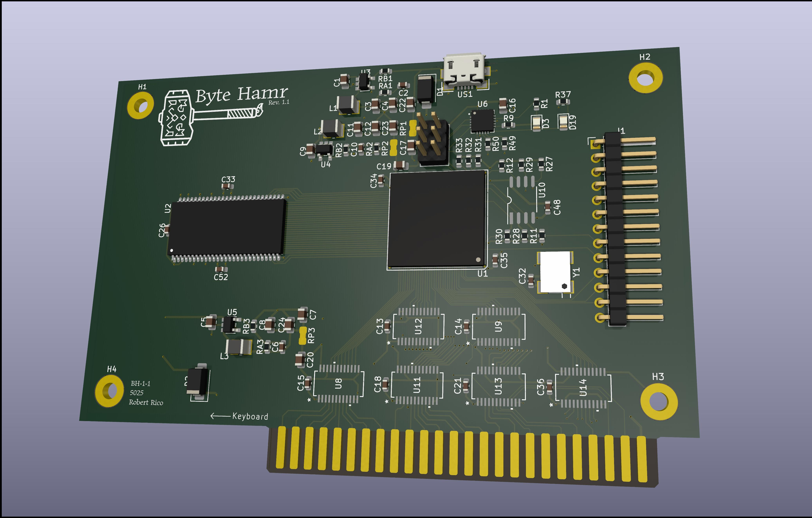

# Byte Hamr

An open-source FPGA expansion card for the Apple II family of computers.



## Overview

Byte Hamr brings modern FPGA capabilities to the Apple II, II+, IIe, and IIgs. Unlike purpose-built cards that serve a single function, Byte Hamr is a general-purpose platform for developing and running custom hardware designs on vintage Apple hardware.

The card sits between the simplicity of the A2FPGA (which targets HDMI output) and the complexity of the Carte Blanche (which is difficult to obtain and uses proprietary tooling). Byte Hamr uses the Lattice ECP5 FPGA with full support for the open-source Yosys/nextpnr toolchain.

## Features

- Lattice ECP5-85F FPGA (85K LUTs, BGA381 package)
- 64MB SDRAM (AS4C32M16SB-7TCNTR)
- 16MB SPI Flash for bitstream storage
- USB programming via FTDI FT231XQ
- JTAG header for development/debugging
- 13-pin GPIO header for FPGA and peripheral expansion
- Full Apple II bus interface with bidirectional level shifting
- Dual power input (USB or Apple II bus) with automatic switching
- On-board 25MHz oscillator
- Open-source hardware and gateware

## Specifications

| Parameter | Value |
|-----------|-------|
| FPGA | Lattice ECP5-85F (LFE5U-85F-8BG381I) |
| Logic Elements | 84K LUTs |
| Block RAM | 3744 Kbit |
| SDRAM | 64MB, 16-bit bus |
| Flash | 16MB SPI |
| USB | Full-speed via FT231XQ |
| GPIO | 13 pins, 3.3V |
| Power | +5V from USB or Apple II slot |
| Dimensions | Standard Apple II card form factor |

## Architecture

```
                                    +------------------+
                                    |     SDRAM        |
                                    |   (64MB x16)     |
                                    +--------+---------+
                                             |
+-------------+     +----------+     +-------+--------+     +----------+
| Apple II    |     | Level    |     |                |     |   SPI    |
| Expansion   +---->+ Shifters +---->+   ECP5-85F     +---->+  Flash   |
| Slot        |     | (5V/3.3V)|     |     FPGA       |     |  (16MB)  |
+-------------+     +----------+     +-------+--------+     +----------+
                                             |
                                     +-------+--------+
                                     |      USB       |
                                     |  (FT231XQ)     |
                                     +----------------+
```

## Power Distribution

Three on-board switching regulators generate the required voltages:

- +3.3V for FPGA I/O, SDRAM, Flash, level shifters
- +2.5V for FPGA auxiliary power
- +1.1V for FPGA core

Power can be sourced from USB (+5V) or the Apple II slot, with Schottky diode OR-ing for automatic switching.

## Bus Interface

Six 74LVC8T245 bidirectional level shifters translate between the Apple II's 5V bus and the FPGA's 3.3V I/O. The interface provides access to:

- 16-bit address bus
- 8-bit data bus (bidirectional)
- Control signals (R/W, PHI0, device select, etc.)

## GPIO Header

13-pin header for FPGA expansion and peripheral connection:

| Pin | Signal | FPGA Site | Description |
|-----|--------|-----------|-------------|
| 1 | GPIO1 | L1 | General purpose I/O |
| 2 | GPIO2 | K1 | General purpose I/O |
| 3 | GPIO3 | J1 | General purpose I/O |
| 4 | GPIO4 | H1 | General purpose I/O |
| 5 | GPIO5 | F2 | General purpose I/O |
| 6 | GPIO6 | E2 | General purpose I/O |
| 7 | GPIO7 | E1 | General purpose I/O |
| 8 | GPIO8 | D1 | General purpose I/O |
| 9 | GPIO9 | C1 | General purpose I/O |
| 10 | GPIO10 | A4 | General purpose I/O |
| 11 | GPIO11 | B5 | General purpose I/O |
| 12 | GPIO12 | A5 | General purpose I/O |
| 13 | GND | - | Ground |

All GPIO pins are 3.3V LVCMOS. See [byte_hamr.lpf](hardware/byte_hamr/constraints/byte_hamr.lpf) for full pin constraints.

## Project Status

**Rev 1** - Sent to fabrication (December 2025)

See [VERSION.md](VERSION.md) for full version history.

## Repository Structure

```
project_byte_hamr/
├── hardware/
│   ├── byte_hamr/          # Main FPGA card
│   │   ├── kicad/          # KiCad project files
│   │   ├── bom/            # Bill of materials
│   │   └── constraints/    # FPGA pin constraints
│   └── byte_ravn/          # GPIO breakout board
│       ├── kicad/          # KiCad project files
│       ├── bom/            # Bill of materials
│       └── gerbers/        # Manufacturing files
├── gateware/
│   └── signal_check/       # Board bring-up test
├── software/
│   └── (coming soon)       # Apple II software
└── docs/                   # Documentation and datasheets
```

## Getting Started

### Prerequisites

<!-- TODO: Verify these links are correct and add installation instructions -->
- [oss-cad-suite](https://github.com/YosysHQ/oss-cad-suite-build) (recommended) or individual tools:
  - [Yosys](https://github.com/YosysHQ/yosys) (synthesis)
  - [nextpnr-ecp5](https://github.com/YosysHQ/nextpnr) (place and route)
  - [openFPGALoader](https://github.com/trabucayre/openFPGALoader) (programming)
- Apple IIe or compatible system

### Building Gateware

```bash
make                    # Build default design (signal_check)
make DESIGN=xxx         # Build specific design
make help               # Show all available targets
```

### Programming

```bash
make prog               # Program via JTAG (volatile, for testing)
make prog-flash         # Program SPI flash (persistent)
```

### Utility Commands

```bash
make pinout             # Regenerate FPGA pinout from schematics
make lpf                # Regenerate LPF constraints
make clean              # Remove build files
```

## Testing

Bringup sequence for new boards:

1. Visual inspection
2. Power rail verification (+5V, +3.3V, +2.5V, +1.1V)
3. USB enumeration (FTDI detection)
4. FPGA configuration with [signal_check](gateware/signal_check/SIGNAL_CHECK.md)
5. Oscillator verification (25MHz on scope)
6. Apple II bus communication (PEEK/POKE test)
7. Full system integration

## Design References

This project builds on the work of others:

- [ULX3S](https://github.com/emard/ulx3s) - ECP5 reference design, power architecture
- [A2FPGA](https://github.com/a2fpga/a2fpga_core) - Apple II FPGA integration concepts
- [Understanding the Apple IIe](https://archive.org/details/understanding_the_apple_iie) - Jim Sather's essential reference

## Why "Byte Hamr"?

"Hamr" is Old Norse for "shape" or "form" — the concept of shapeshifting in Norse mythology. Byte Hamr: shapeshifting bytes. An FPGA that can become any hardware you define. The shape changes based on what you program it to be.

## License

This project is released under the [MIT License](LICENSE.md).

## Author

Robert Rico

## Contributing

This is an early-stage project. Issues, suggestions, and pull requests welcome once Rev 1 hardware is validated.

## Up Next: Byte Ravn

**Byte Ravn** is a companion breakout board that connects to the Byte Hamr GPIO header, providing easy access to FPGA I/O for prototyping and peripheral development.

Design files are in [hardware/byte_ravn/](hardware/byte_ravn/).

---