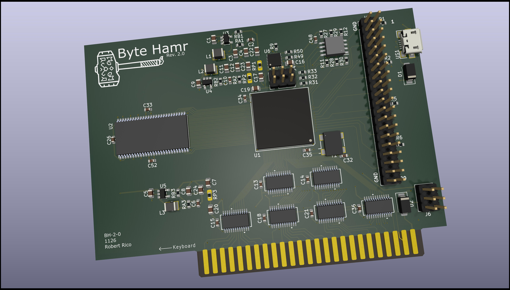

# Byte Hamr

An open-source FPGA expansion card for the Apple II family of computers.



## Overview

Byte Hamr brings modern FPGA capabilities to the Apple II, II+, IIe, and IIgs. Unlike purpose-built cards that serve a single function, Byte Hamr is a general-purpose platform for developing and running custom hardware designs on vintage Apple hardware.

The card sits between the simplicity of the A2FPGA (which targets HDMI output) and the complexity of the Carte Blanche (which is difficult to obtain and uses proprietary tooling). Byte Hamr uses the Lattice ECP5 FPGA with full support for the open-source Yosys/nextpnr toolchain.

## Features

- Lattice ECP5-85F FPGA (84K LUTs, BGA381 package)
- 64MB SDRAM (AS4C32M16SB-7TCNTR)
- 128Mb SPI Flash for bitstream storage
- USB programming via FTDI FT231XQ
- JTAG header for development/debugging
- 20-pin GPIO header with heavy ground interleaving (Rev 2)
- 2×3 power breakout: +3V3, +5V, −5V, +12V, −12V (Rev 2)
- Full Apple II bus interface with bidirectional level shifting
- Dedicated FPGA-controlled data-bus transceiver OE (Rev 2)
- Hardware R/W inverter for correct transceiver direction (Rev 2)
- Bidirectional nRES — drive *and* monitor Apple II reset (Rev 2)
- Dual power input (USB or Apple II bus) with automatic switching
- On-board 100 MHz oscillator (Rev 2; 25 MHz on Rev 1)
- Open-source hardware and gateware

## Specifications

| Parameter | Value |
|-----------|-------|
| FPGA | Lattice ECP5-85F (LFE5U-85F-8BG381I) |
| Logic Elements | 84K LUTs |
| Block RAM | 3744 Kbit |
| SDRAM | 64MB, 16-bit bus |
| Flash | 128Mb SPI |
| USB | Full-speed via FT231XQ |
| GPIO | 20 pins, 3.3V LVCMOS33 |
| Oscillator | 100 MHz (Rev 2) |
| Power | +5V from USB or Apple II slot |
| Dimensions | Standard Apple II card form factor |

## Architecture

```
                                    +------------------+
                                    |     SDRAM        |
                                    |   (64MB x16)     |
                                    +--------+---------+
                                             |
+-------------+     +----------+     +-------+--------+     +----------+
| Apple II    |     | Level    |     |                |     |   SPI    |
| Expansion   +---->+ Shifters +---->+   ECP5-85F     +---->+  Flash   |
| Slot        |     | (5V/3.3V)|     |     FPGA       |     |  (16MB)  |
+-------------+     +----------+     +-------+--------+     +----------+
                                             |
                                     +-------+--------+
                                     |      USB       |
                                     |  (FT231XQ)     |
                                     +----------------+
```

## Power Distribution

Three on-board switching regulators generate the required voltages:

- +3.3V for FPGA I/O, SDRAM, Flash, level shifters
- +2.5V for FPGA auxiliary power
- +1.1V for FPGA core

Power can be sourced from USB (+5V) or the Apple II slot, with Schottky diode OR-ing for automatic switching. Rev 2 moves the 5V input diode ahead of the level-shifter rail so USB alone can power the bus logic.

## Bus Interface

Six 74LVC8T245 bidirectional level shifters translate between the Apple II's 5V bus and the FPGA's 3.3V I/O. The interface provides access to:

- 16-bit address bus
- 8-bit data bus (bidirectional)
- Control signals (R/W, PHI0, device select, etc.)

Rev 2 adds a dedicated 74AHC1G04 inverter (`U7`) that generates the correct-polarity DIR control for the data-bus transceiver, and exposes the transceiver's OE on an FPGA pin so gateware can cleanly gate drive.

## GPIO Header

20-pin header with ground interleaving (pin `1` marked at the top, `20` at the bottom). All pins are 3.3V LVCMOS33.

| GPIO | FPGA Site |   | GPIO | FPGA Site |
|------|-----------|---|------|-----------|
| GPIO_1  | P3 |   | GPIO_11 | J1 |
| GPIO_2  | P1 |   | GPIO_12 | H2 |
| GPIO_3  | P2 |   | GPIO_13 | H1 |
| GPIO_4  | N1 |   | GPIO_14 | G2 |
| GPIO_5  | M1 |   | GPIO_15 | G1 |
| GPIO_6  | L2 |   | GPIO_16 | F2 |
| GPIO_7  | L1 |   | GPIO_17 | F1 |
| GPIO_8  | K3 |   | GPIO_18 | E2 |
| GPIO_9  | K1 |   | GPIO_19 | E1 |
| GPIO_10 | K2 |   | GPIO_20 | D2 |

See [byte_hamr.lpf](gateware/rev2/constraints/byte_hamr.lpf) for full pin constraints.

## Project Status

**Rev 2** — fabricated and bring-up in progress (April 2026). Both boards enumerate over USB and pass initial SDRAM + GPIO tests.

**Rev 1** — sent to fabrication (December 2025). Tagged `rev1` in git; all Rev 1 gateware preserved under `gateware/rev1/`.

See [VERSION.md](VERSION.md) for full version history.

### Rev 2 changes

- Board footprint shrunk
- GPIO expanded from 12 → 20 pins with dense ground interleaving
- Power breakout block exposing ±5V / ±12V / 3V3
- On-board R/W inverter (replaces Rev 1 bodge wire)
- 5V diode moved ahead of level shifters so USB can power the bus side
- Shortened SDRAM routes to the ECP5
- Data-bus transceiver OE promoted from GPIO bodge to dedicated FPGA pin (`DATA_OE`, B20)
- Bidirectional nRES: separate `nRES_READ` input (A5) so gateware can monitor Apple II reset
- Oscillator upgraded 25 MHz → 100 MHz for better CDC oversampling and PLL headroom

## Repository Structure

```
project_byte_hamr/
├── hardware/
│   └── byte_hamr/          # Main FPGA card
│       ├── kicad/          # KiCad schematic and PCB
│       ├── bom/            # Bill of materials
│       └── gerbers/        # Manufacturing files
├── gateware/
│   ├── rev1/               # Rev 1 designs (frozen, matches rev1 git tag)
│   │   ├── constraints/
│   │   ├── signal_check/
│   │   ├── sdram_test/
│   │   ├── sdram_bank/
│   │   ├── pattern_rom/
│   │   ├── logic_hamr/
│   │   ├── smart_hamr/
│   │   ├── block_hamr/
│   │   └── flash_hamr/
│   └── rev2/               # Rev 2 designs (porting in progress)
│       ├── constraints/
│       └── signal_check/
├── software/
│   ├── ASM/                # 6502 assembly source (Merlin32)
│   ├── LOGICHAMR/          # Logic analyzer disk contents
│   └── utils/              # Disk image utilities
└── docs/                   # Documentation
```

## Getting Started

### Prerequisites

**Gateware:**
- [oss-cad-suite](https://github.com/YosysHQ/oss-cad-suite-build) (recommended) or individual tools:
  - [Yosys](https://github.com/YosysHQ/yosys) (synthesis)
  - [nextpnr-ecp5](https://github.com/YosysHQ/nextpnr) (place and route)
  - [openFPGALoader](https://github.com/trabucayre/openFPGALoader) (programming)

**6502 Assembly:**
- [Merlin32](https://brutaldeluxe.fr/products/crossdevtools/merlin/) (cross-assembler)

**Disk Utilities:**
- [AppleCommander](https://applecommander.github.io/) (disk image manipulation)
- [ADTPro](https://adtpro.com/) (disk transfer to real hardware)
- Java runtime

### Building Gateware

Builds are selected by `DESIGN` and `REV`. `REV` defaults to `rev1`; set `REV=rev2` when targeting the current hardware.

```bash
make                                # Build default (REV=rev1, DESIGN=signal_check)
make DESIGN=xxx                     # Build specific design (rev1)
make DESIGN=xxx REV=rev2            # Build against Rev 2 pinout
make sim DESIGN=xxx REV=rev2        # Run simulation
make wave                           # Run simulation and open GTKWave
make help                           # Show all available targets
```

### Programming

```bash
make DESIGN=xxx REV=rev2 prog                         # Program via JTAG (volatile)
make DESIGN=xxx REV=rev2 prog-flash                   # Program SPI flash (persistent)
make DESIGN=xxx REV=rev2 prog-flash SERIAL=<FTDI_SN>  # Target a specific board
```

### Software Development Workflow

```
┌─────────────┐     ┌───────────────┐     ┌─────────────┐     ┌───────────┐
│  Merlin32   │────▶│ AppleCommander│────▶│   ADTPro    │────▶│ Apple IIe │
│  (assemble) │     │ (create .dsk) │     │  (transfer) │     │   (run)   │
└─────────────┘     └───────────────┘     └─────────────┘     └───────────┘
```

```bash
# 1. Edit source in software/LOGICHAMR/*.S

# 2. Assemble with Merlin32
make assemble ASM_SRC=software/LOGICHAMR/LOGIC.S

# 3. Create disk image (auto-copied to ADTPro disks folder)
make create-dsk DSK=LOGICHAMR

# 4. Transfer via ADTPro to real hardware

# 5. On Apple II: BRUN LOGIC
```

**Disk utilities:**
```bash
make extract-dsk DSK=file.dsk     # Extract files from disk image
make list-dsk                     # List disks in ADTPro folder
```

### Utility Commands

```bash
make pinout             # Regenerate FPGA pinout from schematics
make lpf                # Regenerate LPF constraints
make clean              # Remove build files
```

## Gateware Designs

Rev 1 versions (proven on Rev 1 hardware):

| Design | Description |
|--------|-------------|
| [signal_check](gateware/rev1/signal_check/SIGNAL_CHECK.md) | Board bring-up test (SDRAM, GPIO, bus monitor) |
| sdram_test | Register-driven SDRAM access from Apple II |
| [sdram_bank](gateware/rev1/sdram_bank/README.md) | SDRAM bank-switching controller |
| [pattern_rom](gateware/rev1/pattern_rom/README.md) | SDRAM-backed pattern ROM for display testing |
| [logic_hamr](gateware/rev1/logic_hamr/README.md) | 8-channel logic analyzer with HIRES display |
| [smart_hamr](gateware/rev1/smart_hamr/README.md) | SmartPort/IWM disk controller with ESP32 companion |
| [block_hamr](gateware/rev1/block_hamr/README.md) | ProDOS block device with SDRAM and SPI flash persistence |
| [flash_hamr](gateware/rev1/flash_hamr/) | SD card ProDOS block device (PicoRV32 + FatFS) |

Rev 2 port: `signal_check` ported and validated; other designs pending.

## Testing

Bringup sequence for new boards:

1. Visual inspection
2. Power rail verification (+5V, +3.3V, +2.5V, +1.1V)
3. USB enumeration (FTDI detection)
4. FPGA configuration with [signal_check](gateware/rev2/signal_check/)
5. Oscillator verification (100 MHz on scope; derived 25 MHz appears on SDRAM_CLK)
6. GPIO walk — watch walking 1s across `GPIO_9`..`GPIO_20`
7. Apple II bus communication (register loopback at $C0C0)
8. Data-bus transceiver + R/W inverter walk: `C0C0:01 → C0C0`, then `02`, `04`, … `80`
9. Full system integration

## Design References

This project builds on the work of others:

- [ULX3S](https://github.com/emard/ulx3s) - ECP5 reference design, power architecture
- [Xander's 8-bit fun](https://xjmaas.wordpress.com/my-apple-collection/apple-edge-connector-template-for-eagle/) - Apple II Edge Card Design
- [Understanding the Apple IIe](https://archive.org/details/understanding_the_apple_iie) - Jim Sather's essential reference

## Why "Byte Hamr"?

"Hamr" is Old Norse for "shape" or "form" — the concept of shapeshifting in Norse mythology. Byte Hamr: shapeshifting bytes. An FPGA that can become any hardware you define. The shape changes based on what you program it to be.

## License

This project is released under the [MIT License](LICENSE.md).

## Author

Robert Rico

## Contributing

This is an early-stage project. Issues, suggestions, and pull requests welcome.
