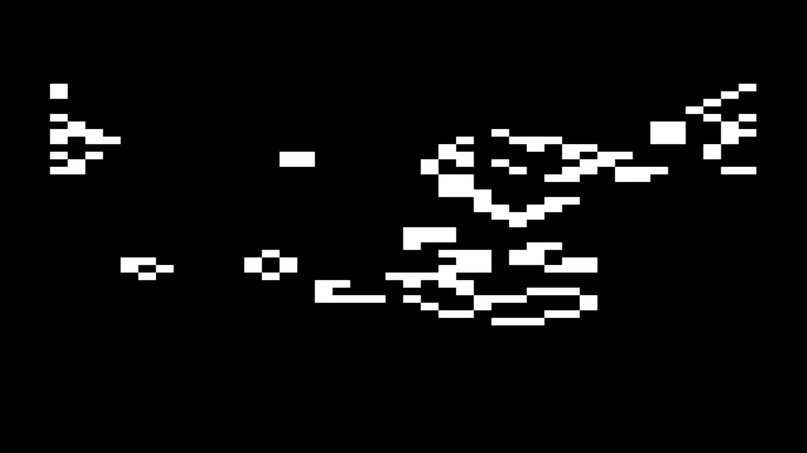
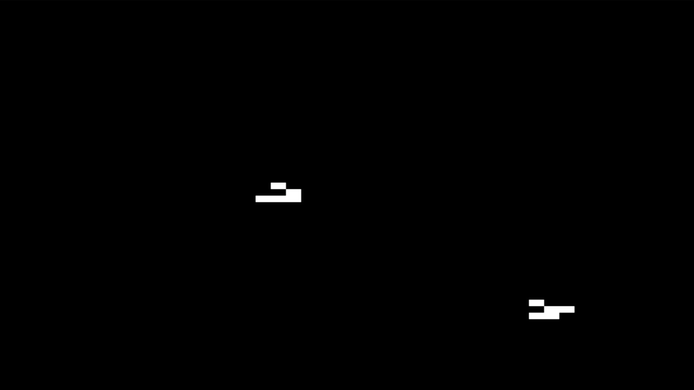
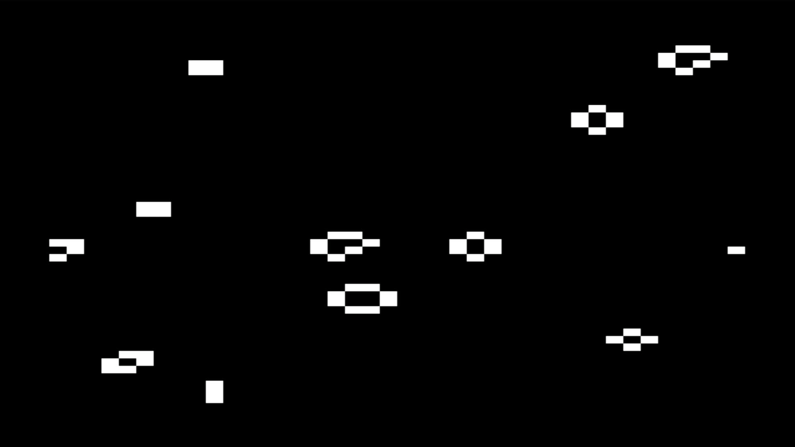
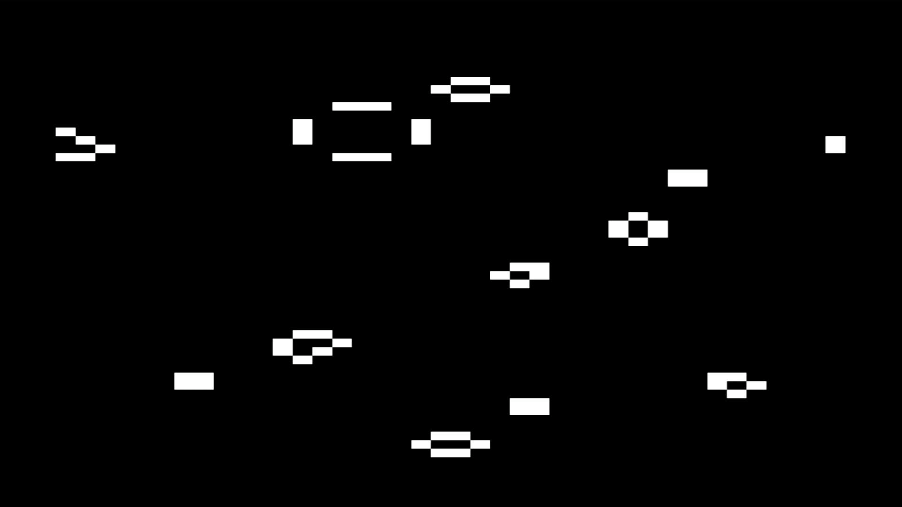
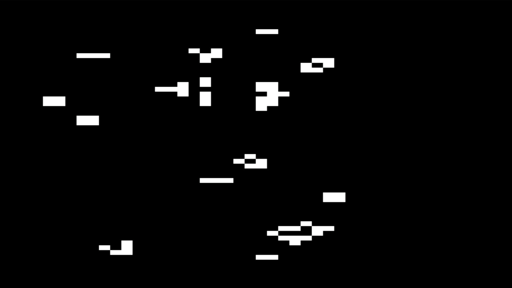

# Conway's Multiverse: A Parallel Processing System with Byte Hamr

The last few updates have been hardware (Rev 2) plus some work getting FujiNet and external tools running. This one is different and it's net-new: a soft 6502 CPU running inside the FPGA, alongside the host Apple IIe.

The idea came from the PicoPort, whose PIO is driven by a small internal RISC-V soft core. The Byte Hamr's ECP5 has plenty of unused logic, so the question was whether the card could run its own processor. A 6502 made sense for this machine. So I built one. This is the first time the Byte Hamr has had a CPU of its own, so I'll introduce it before the demo.

## The soft core

It's Arlet Ottens' `verilog-6502` synthesized into the ECP5, running from its own block RAM and sharing the card's SDRAM with the host through an arbiter. I built it up in stages, each one bench-verified before the next:

- It executes 6502 code from its own RAM and posts results to SDRAM that the IIe can read.
- A resident, hardware-protected kernel that the host can register tasks into.
- A multitasking scheduler, first cooperative, then preemptive: two hand-written tasks race, and tuning their budgets flips the winner.
- Flash persistence: register a task, save it, power-cycle, it's still there.
- Most recently, the coprocessor learned to read SDRAM, not just write it. That's the piece that makes the rest possible.

The useful way to think about it is an active database with a CPU attached. You load small 6502 routines ("skills") onto the card, they run in the background in parallel with the IIe, and the host queries the results. I wanted something to exercise the whole thing: parallel, visually obvious, and a known quantity so a wrong result would be immediately apparent.

Conway's Game of Life. Eight of them, at the same time.

## Eight live universes, one viewer

There are eight independent Life universes living in the card's SDRAM, all evolving at once. The Apple IIe is not running Life. The IIe is the viewer: it picks one universe, draws it, and lets you switch between them with the `0`-`7` keys. The simulation runs on the soft core in the background whether you're watching a given universe or not. Switch to channel 3, come back two minutes later, and it has advanced without you.

This is the active-database idea made concrete. Eight grids that are too large to hold in the IIe's RAM and too slow to compute on its 1 MHz 6502, so they live on the card, the card computes them continuously, and the IIe stays a thin renderer that reads and draws. The engine is one registered skill, `LIFE8`, that the host loads into the soft core and then leaves alone. It loops over the eight universes forever, ticking each in turn. Bit-packed cells, a three-row sliding window so each SDRAM row is read once, wrap-around (toroidal) edges. It runs on a card that is already flashed; no reflash is needed to load it.

## Speed and resolution

The soft 6502 runs at about 25 MHz, but it's still a 6502, computing one cell's neighbors at a time. A full Double Hi-Res grid (560x192, about 107,000 cells) takes a few seconds per generation, times eight universes. So each universe advances every few seconds.

I built the Double Hi-Res version first for maximum resolution. It works, but it's hard to watch: small pixels, slow. So I also made a Lo-Res version at 40x48, about 56x fewer cells, which runs near real time with large, clearly visible blocks. Both ship. The screenshots below are the Lo-Res version.

## The structures

Random soup is fine, but the evidence that it computes correct Conway rules is in the structures that emerge.

Gliders. The five-cell spaceship, in flight, moving diagonally and wrapping around the torus edges. A glider holding its shape while it travels is the strongest correctness test available, since it requires both the neighbor count and the propagation to be exact. In simulation I verified one crossing a packed-byte boundary lands one cell over and one cell down every four generations.

An R-pentomino, settled. Channel 3 seeds the R-pentomino, a five-cell pattern that evolves chaotically for over a thousand generations and then stabilizes. Here it has stabilized into the expected result: beehives, blocks, blinkers, and beacons. Those are the standard Life still-lifes and period-2 oscillators. A bug would produce noise; this produces the correct stable set.

Soup that has organized. Note the box-and-bars structure that alternates between two states (a period-2 oscillator), with beehives and a stray glider around it.

Soup still in progress. A different random seed, mid-evolution, with structures still resolving.

## Implementation notes

A few things worth recording.

A glider gun does not survive on a torus. I first seeded channel 0 with a Gosper glider gun. It collapsed. A gun emits a continuous stream of gliders, but on a wrap-around grid those gliders travel all the way around and collide with the gun, destroying it. Guns need an open or dead-edge field, not a torus.

Double Hi-Res and Lo-Res are different memory formats. DHGR packs 7 monochrome pixels per byte, so the grid stored 7 cells per byte and the render was a direct copy. Lo-Res is a color-block format: each byte holds two stacked 4-bit color blocks, not seven bits. So the grid stays bit-packed for the engine, but the Lo-Res renderer has to expand each cell bit into a `$0` or `$F` nibble. It is not a copy.

Tearing behaves opposite at higher speed. The double-buffer scheme that kept DHGR clean relied on the soft core taking 1.5 to 3 seconds to return to the universe being viewed, far longer than a host draw. At Lo-Res the core laps the host within a single frame and flips buffers mid-draw, producing mixed-generation frames. The fix is a generation-stamped snapshot: copy the (small) grid to host memory, confirm the generation counter did not change during the copy, and retry if it did.

The row stride was a separate hand-written routine, not the width constant. When I cloned the engine for Lo-Res I changed the width equate and got garbage, because the row-offset multiply (`MUL80`) was its own code. It had to change to `MUL5` for the 5-byte Lo-Res rows.

## What's next

Life is one demo, but the real point is the model: work that runs on the card, in the background, independent of host action. That opens up things the Apple IIe could not do on its own. The next direction is other async processes built on this. A live database the host queries. Or a game where the simulation runs continuously instead of per-click or per-turn: you can stand still and the day still passes, crops still grow, space trades still happen, all computed on the card while the IIe just looks in on the current state.

For now the soft core demonstrates the full stack: a parallel, persistent, queryable processor running on a card next to a 1 MHz machine.

Code is on GitHub (the `software/SDM/` skills and the `project_obscurus` gateware). Questions and feedback welcome.
